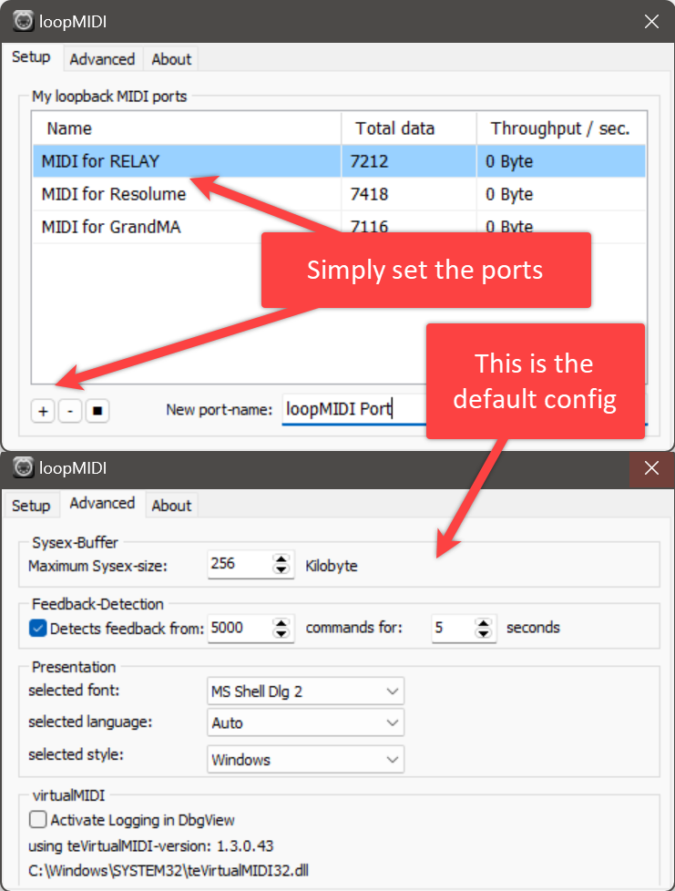
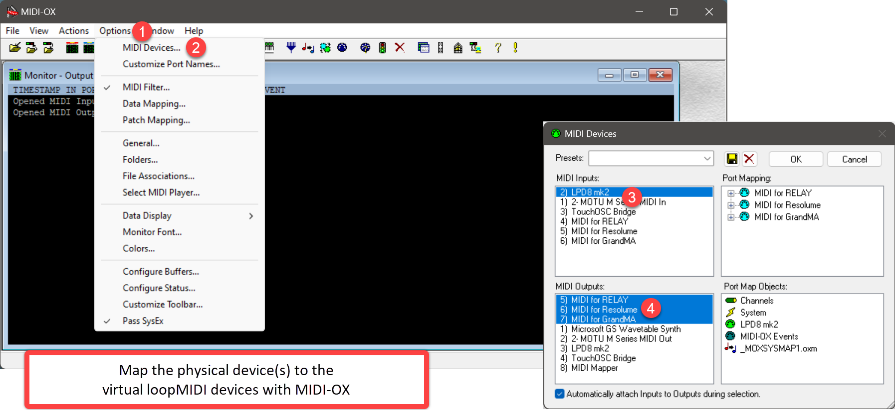
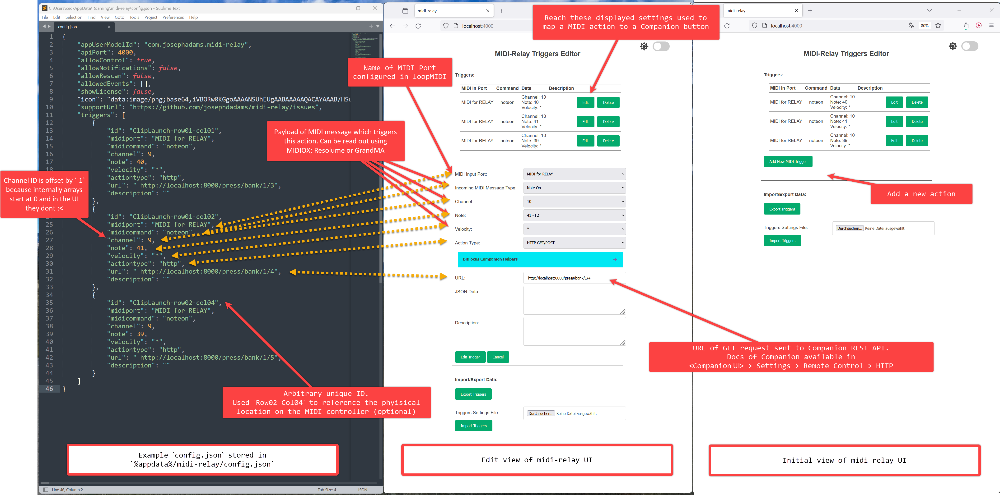

# Overview

Sketch of how the software works to transform a generic MIDI device into a device that can control about anything on your computer.

## loopMIDI

Use LoopMIDI to create virtual MIDI ports in Windows. On MacOS this can be ignored, as MacOS automatically creates a layer between the physical and software connection.

## MIDI-OX

Use this software to patch the physical MIDI connection from the controller to the aforementioned virtual connections from loopMIDI. This step can also be ignored using MacOS.

## midi-relay

Simple utility that listens to MIDI signals and triggers REST calls, which can be sent to Companion.

## Companion

We are not going to introduce Companion here, there's plenty other resources for this. This is the setup how to add a button that triggers a script on the host machine of the Companion instance.

## AutoHotKey

Utility used to control about anything in Windows.

- Used for the [startup sequence](../ahk/sequence_midi_utils.ahk) of the required software. Because the ports have to be setup in a specific order and the software is so niche that it does not support Windows services.

- Used [open Resolume](../ahk/open_resolume.ahk) on the host machine to identify and open the Resolume window.

- [Keyboard shortcuts](../ahk/keyboard_shortcuts.ahk) is optional, this script links the actions to shortcuts on the normal Windows keyboard.
